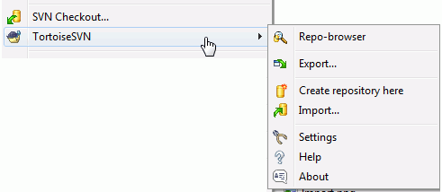

# 2.1 Basic Concepts

Before we get stuck into working with some real files, it is important to get an overview of how Subversion works and the terms that are used.

**The Repository**

Subversion uses a central database which contains all your version-controlled files with their complete history. This database is referred to as the repository. The repository normally lives on a file server running the Subversion server program, which supplies content to Subversion clients \(like TortoiseSVN\) on request. If you only back up one thing, back up your repository as it is the definitive master copy of all your data.

**Working Copy**

This is where you do the real work. Every developer has his own working copy, sometimes known as a sandbox, on his local PC. You can pull down the latest version from the repository, work on it locally without affecting anyone else, then when you are happy with the changes you made commit them back to the repository.

A Subversion working copy does not contain the history of the project, but it does keep a copy of the files as they exist in the repository before you started making changes. This means that it is easy to check exactly what changes you have made.

We also need to know where to find TortoiseSVN because there is not much to see from the Start Menu. This is because TortoiseSVN is a Shell extension, so first of all, start Windows Explorer. Right click on a folder in Explorer and you should see some new entries in the context menu like this:

**Figure 1.1. The TortoiseSVN menu for unversioned folders**

