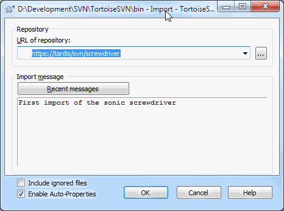

# 2.3 Importing a Project

Now we have a repository, but it is completely empty at the moment. Let's assume I have a set of files in C:\Projects\Widget1 that I would like to add. Navigate to the Widget1 folder in Explorer and right click on it. Now select TortoiseSVN → Import... which brings up a dialog

**Figure 1.2. The Import dialog**

A Subversion repository is referred to by URL, which allows us to specify a repository anywhere on the Internet. In this case we need to point to our own local repository which has a URL of file:///c:/svn\_repos/trunk, and to which we add our own project name Widget1. Note that there are 3 slashes after file: and that forward slashes are used throughout.

The other important feature of this dialog is the Import Message box which allows you to enter a message describing what you are doing. When you come to look through your project history, these commit messages are a valuable guide to what changes have been made and why. In this case we can say something simple like “Import the Widget1 project”. Click on OK and the folder is added to your repository.

