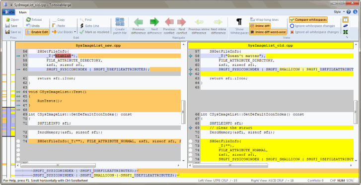

# 2.5 Making Changes

Time to get to work. In the Widget1-Dev folder we start editing files - let's say we make changes to Widget1.c and ReadMe.txt. Notice that the icon overlays on these files have now changed to red, indicating that changes have been made locally.

But what are the changes? Right click on one of the changed files and select TortoiseSVN → Diff. TortoiseSVN's file compare tool starts, showing us exactly which lines have changed.

**Figure 1.3. File Difference Viewer**

OK, so we are happy with the changes, let's update the repository. This action is referred to as a Commit of the changes. Right click on the Widget1-Dev folder and select TortoiseSVN → Commit. The commit dialog lists the changed files, each with a checkbox. You might want to choose only a subset of those files, but in this case we are going to commit the changes to both files. Enter up a message to describe what the change is all about and click on OK. The progress dialog shows the files being uploaded to the repository and you're done.

