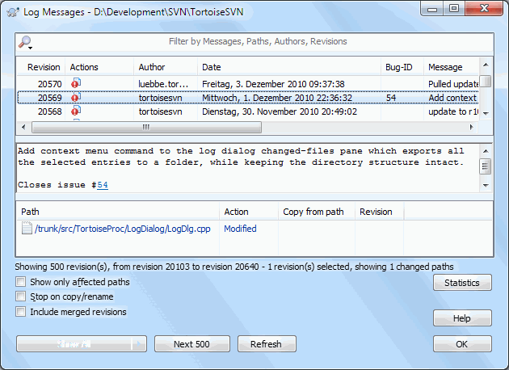

# 2.7 Viewing the Project History

One of the most useful features of TortoiseSVN is the Log dialog. This shows you a list of all the commits you made to a file or folder, and shows those detailed commit messages that you entered \(you did enter a commit message as suggested? If not, now you see why this is important\).

**Figure 1.4. The Log Dialog**

OK, so I did a little trick over here and used a screenshot from the TortoiseSVN repository.

The top pane shows a list of revisions committed along with the start of the commit message. If you select one of these revisions, the middle pane will show the full log message for that revision and the bottom pane will show a list of changed files and folders.

Each of these panes has a context menu which provides you with lots more ways of using the information. In the bottom pane you can double click on a file to see exactly what changes were made in that revision.

