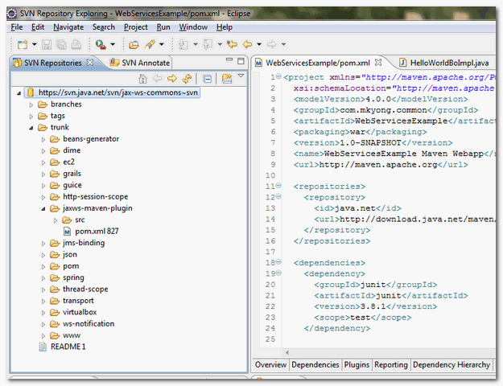

# 3.1 Installation of the Subclipse Plug-In

Get the latest plugin from [http://subclipse.tigris.org/](http://subclipse.tigris.org/) , click on the “Download and Install” tab. Enter “**Eclipse update site URL**” for Subclipse plugin, - [http://subclipse.tigris.org/update\_1.6.x](http://subclipse.tigris.org/update_1.6.x).

In Eclipse IDE, Go to the Toolbar menu, select “Help” “Install New Software”. And put the URL [http://subclipse.tigris.org/update\_1.6.x](http://subclipse.tigris.org/update_1.6.x) in the “work with” textbox and click on the “Add” button. Select all components and install it.

Restart Eclipse IDE to take effect.

