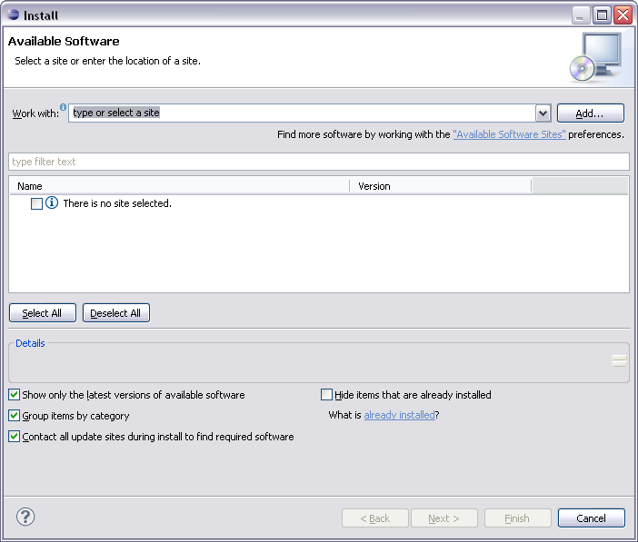
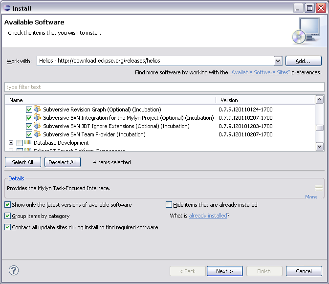
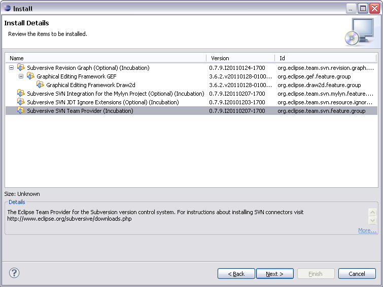
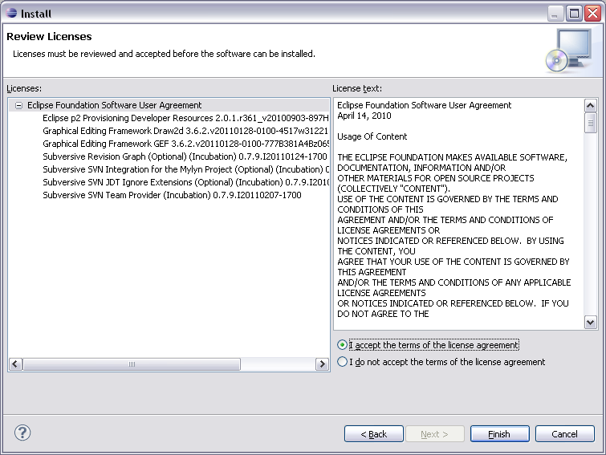
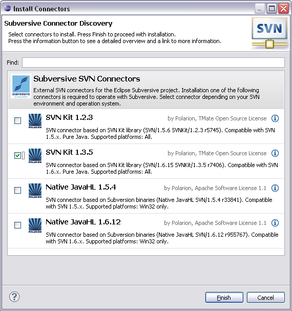
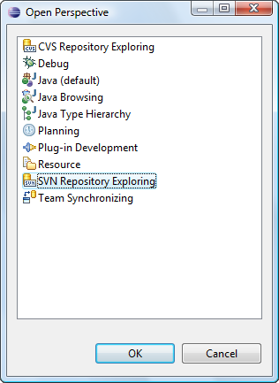
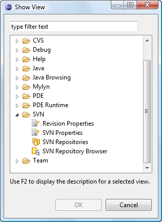

# 3.2 Installation of the Subversive Plug-In

Subversive can be simply installed from within Eclipse using update manager. All what the user should do is just point update manager to the remote or local update site. To install Subversive:

1. Start Eclipse and select menu item _'Help &gt; Instal New Software_

_..'_ 

1. Then select common software repository or if you need to install Subversive only, you can directly add Subversive update site by pressing _'Add'_ button. 
2. On the _'Add Repository'_ form enter the URL to the Subversive update site. The proper URL can be found on [http://www.eclipse.org/subversive/downloads.php](http://www.eclipse.org/subversive/downloads.php). Also the update-site for Subversive integration plug-ins can be added in the same way.
   * _Please note that the use of the software you are about to access may be subject to third party terms and conditions and you are responsible for abiding by such terms and conditions._

Click on the _'OK'_ button to store update site information. 

1. The Subversive software can be found in the common software repository in 'Collaboration Tools' section and provides following features list. Required feature, which should be installed unconditionally:
   * **SVN Team Provider** - The Eclipse Team Provider for the Subversion version control system.
2. Optional integrations with other plug-ins, which can be installed if you use these plugins and want to have them integrated with Subversive:
   * **Subversive Integration for the Mylyn Project** - Integration with Mylyn \([http://www.eclipse.org/mylyn/](http://www.eclipse.org/mylyn/)\).

Other optional features:

* * **JDT Ignore Extensions** - The feature is useful for Java development because it allows to interpret output folders as ignored resources automatically.
  * **Revision Graph** - The feature is useful for visual browsing of the SVN revisions tree.
  * **SVN Team Provider Sources** - The sources of the Eclipse Team Provider for Subversion.

Select Subversive SVN Team Provider and other features if required and then follow through installation wizard steps.

1. The update manager calculates dependencies and offers you a list of features to install. Select the needed ones and click the _'Next &gt;'_ button.

1. Accept terms of license agreement and click the _'Finish'_ button in order to start the download of selected features. 
2. To apply installation changes and restart Eclipse click on the _'Yes'_ button. 
3. After Eclipse restart you'll see connectors discovery dialog which will allow you to install Subversive Connectors without registering connectors update site manually. 
4. If you wish, you can select multiple connectors and follow the installation procedure. After installation, you can switch the connector using the main menu item **Window** &gt; **Preferences** &gt; **Team** \(tree node\) &gt; **SVN** \(tree node\) &gt; **SVN Connector** \(tab\).
5. You can find Subversive perspective and views in correspondent dialogs, activated by menu items _'Window &gt; Open Perspective &gt; Other...'_ and _'Window &gt; Show View &gt; Other...'_.

|  |  |
| --- | --- |

Now you are ready to work in Eclipse using SVN

