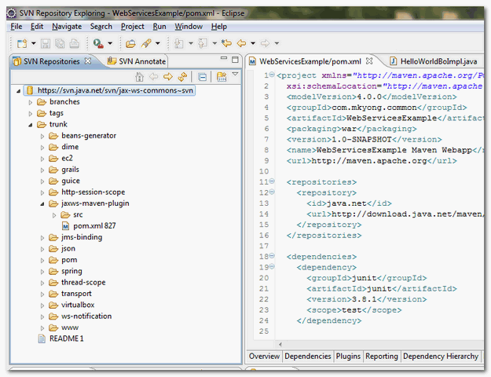

# 4.1 SVN Explorer View

In Eclipse IDE, From menu, select “Windows” “Open Perspective” “Other…”, choose “**SVN Repositories**“.

Now, you can perform SVN functionality in this “**SVN Repositories**” perspective.

Hope you liked the tutorial which gave heads-up about the tool and its features. :\)

