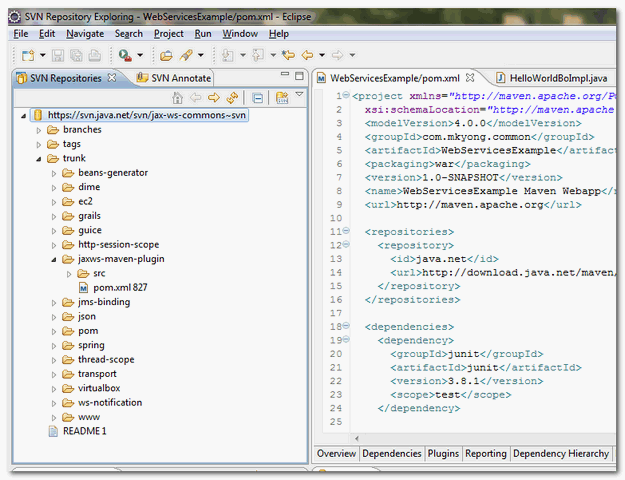

### SVN Explorer View {#svn-explorer-view}

In Eclipse IDE, From menu, select “Windows” “Open Perspective” “Other…”, choose “**SVN Repositories**“.

Now, you can perform SVN functionality in this “**SVN Repositories**” perspective.